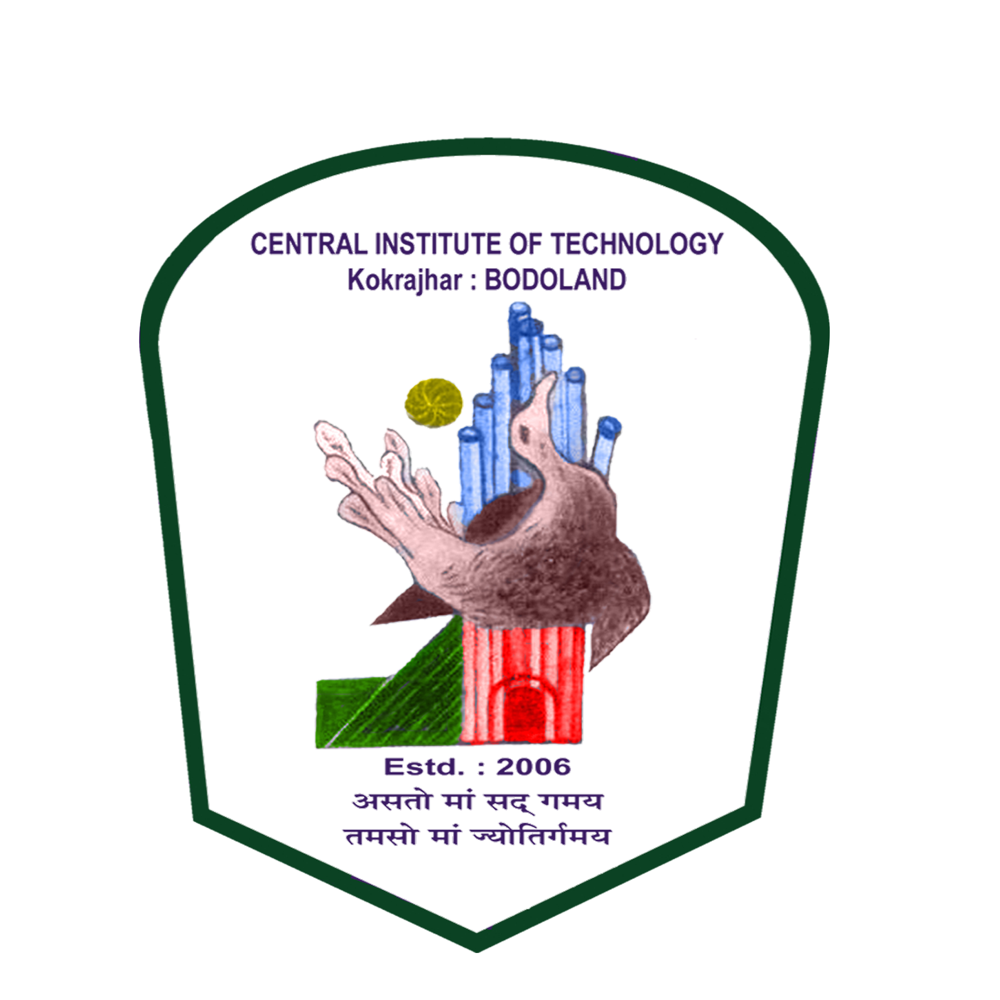
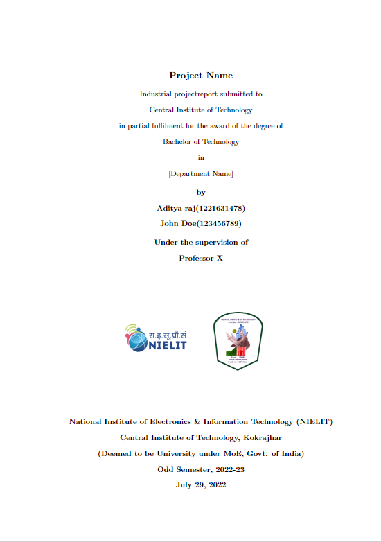

  
  

# Industrial Training Report Template :memo:

 LaTex project report template for Industrial Training jointly organised by CITK and NIELIT.

## Screenshots

## Authors

- [@Swaubhik](https://www.github.com/swaubhik)
- [@Aditya](https://www.github.com/Aditya301-raj)

